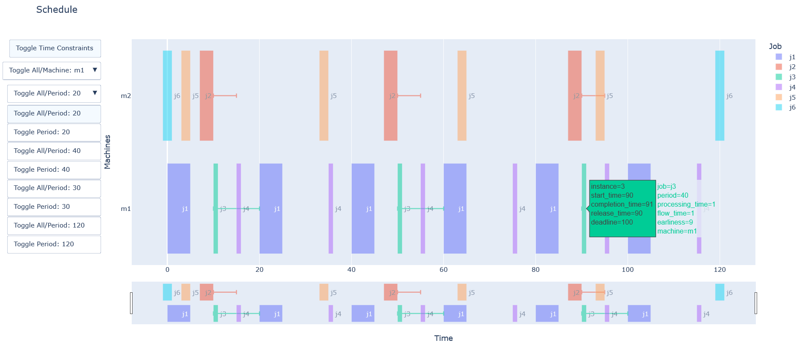

# Periodic Scheduling

This repository serves to provide utilities for creating, verifying, and visualizing [periodic](https://scholar.google.com/scholar?q=Survey+on+Periodic+Scheduling+for+Time-triggered+Hard+Real-time+Systems) [scheduling problems](https://en.wikipedia.org/wiki/Optimal_job_scheduling) (PSP) / periodic event scheduling problems (PESP). In particular, the scheduling problem being solved here is defined as $R|T_j,r_j,d_j,\text{mltrt},l_{ij},s_{ij}|\sum w^c_j C_j + \sum w^f_j F_j + \sum w^e_j E_j$ according to the [three-field scheduling notation](https://scholar.google.com/scholar?q=Survey+on+Periodic+Scheduling+for+Time-triggered+Hard+Real-time+Systems) and has the following [machine environment](https://en.wikipedia.org/wiki/Optimal_job_scheduling#Machine_environments), [job characteristics](https://en.wikipedia.org/wiki/Optimal_job_scheduling#Job_characteristics), and [objective functions](https://en.wikipedia.org/wiki/Optimal_job_scheduling#Objective_functions):

* $R$: single stage, [unrelated machines](https://en.wikipedia.org/wiki/Unrelated-machines_scheduling)
* $m(j) == m(i)$: specified jobs must run on the same machine
* $T_j$: periodic
* $p_j$: arbitrary processing times
* $r_j$: arbitrary release times
* $d_j$: arbitrary deadlines
* $\text{mltrt}$: multi-rate precedence relations
* $l_{ij}$: arbitrary time lags
* $s_{ij}$: arbitrary slack times $^1$
* $\text{min} \sum w^c_j C_j$: minimize a weighted sum of completion times
* $\text{min} \sum w^f_j F_j$: minimize a weighted sum of flow times
* $\text{min} \sum w^e_j E_j$: minimize a weighted sum of earliness
* $\text{min} \sum w^c_{ij} C_{ij}$: minimize a weighted sum of completion times with respect to predecessors $^2$
* $\text{min} \sum w^f_{ij} F_{ij}$: minimize a weighted sum of flow times with respect to predecessors $^3$
* $\text{min} \sum w^e_{ij} E_{ij}$: minimize a weighted sum of earliness with respect to predecessors $^4$

$^1$ The slack time between two jobs is the amount of time in which the second job must be started after the first job is completed. Formally, if job $i$ precedes job $j$, then $C_i + s_{ij} \geq S_j$ must be true. $C_i$ is the completion time of job $i$, $s_{ij}$ is the slack time job $j$ is allowed following job $i$, and $S_j$ is the start time of job $j$.
The term is based on [project management terminology](https://en.wikipedia.org/wiki/Float_(project_management)) as the three-field scheduling notation has no widespread term for this concept.

$^2$ The completion time of job $j$ with respect to predecessor job $i$ is defined as $C_{ij} = C_j - C_i$. Minimizing this objective will yield a solution where job $j$ completes as early as possible to job $i$'s completion, without trying to complete as early as possible from the beginning of the schedule.

$^3$ The flow time of job $j$ with respect to predecessor job $i$ is defined as $F_{ij} = C_{ij} - l_{ij}$. Minimizing this objective will yield a solution where job $j$ completes as early as possible to the time lag ($l_{ij}$) from job $i$. Here, the time lag is the predecessor analagous to the release time.

$^4$ The earliness of job $j$ with respect to predecessor job $i$ is defined as $E_{ij} = s_{ij} - C_{ij}$. Minimizing this objective will yield a solution where job $j$ completes as close as possible to the slack time ($s_{ij}$) from job $i$. Here, the slack time is the predecessor analagous to the deadline.

[](./schedule_demo.png)

## Dependencies

* [uv](https://docs.astral.sh/uv/)

## `schedule.py`

This script attempts to find a feasible schedule based on the parameters of the problem. The parameters are specified as [toml](https://toml.io) via [standard input (stdin)](https://en.wikipedia.org/wiki/Standard_streams#Standard_input_(stdin)). If a feasible schedule exists, an output [csv](https://www.ietf.org/rfc/rfc4180.txt) is created with the start times that have been solved for as well as the input parameters. This output can be visualized with the `schedule_viz.py` script. If the start times are all specified, the script verifies if the schedule is feasible.

To create or verify a schedule enter the input via stdin.
For most shells, entering the following in the terminal will work:

```bash
uv run schedule.py < schedule_input.toml
```

If you have multiple input files, want to split your input across multiple files, or want to read from multiple files and `stdin`, then you can concatenate the various inputs before passing them to `schedule.py`. This can be done using a [pipe (`|`)](https://en.wikipedia.org/wiki/Pipeline_(Unix)) or [process substitution (`<()`)](https://tldp.org/LDP/abs/html/process-sub.html). Below is an example using `cat` to concatenate input from multiple files and `stdin` (`-`):

```bash
# Pipe
cat schedule_input.toml solver_parameters.toml - | uv run schedule.py

# Process substitution
uv run schedule.py < <(cat schedule_input.toml solver_parameters.toml -)
```

`-` is a conventional parameter for capturing input on `stdin`.

The output is sent to the [standard output (stdout)](https://en.wikipedia.org/wiki/Standard_streams#Standard_output_(stdout)). To capture the output in a file for most shells, run like so:

```bash
uv run schedule.py < schedule_input.toml > schedule_output.csv
```

Note that PowerShell support for stdout is slightly broken. See [this workaround](https://github.com/PowerShell/PowerShell/issues/5974#issuecomment-1297513901).

## `schedule_viz.py`

A schedule csv can be visualized with the `schedule_viz.py` script via stdin:

```bash
uv run schedule_viz.py < schedule_output.csv
```

To directly visualize the output of `schedule.py`, you can utilize a pipe like so:

```bash
uv run schedule.py < schedule_input.csv | uv run schedule_viz.py
```

## Additional Notes

A great resource on modeling periodic scheduling problems is [Survey on Periodic Scheduling for Time-triggered Hard Real-time Systems](https://dl.acm.org/doi/abs/10.1145/3431232).

### CP-SAT

The underlying solver used for this codebase is [CP-SAT](https://developers.google.com/optimization/cp) which is a part of [OR-Tools](https://developers.google.com/optimization/). In addition to the OR-Tools' own [Scheduling Overview](https://developers.google.com/optimization/scheduling), [`docs/scheduling.md`](https://github.com/google/or-tools/blob/stable/ortools/sat/docs/scheduling.md), and the [user manual](https://acrogenesis.com/or-tools/documentation/user_manual/manual/ls/scheduling_or_tools.html)'s [scheduling page](https://acrogenesis.com/or-tools/documentation/user_manual/manual/ls/scheduling_or_tools.html), [@d-krupke](https://github.com/d-krupke)'s [CP-SAT Primer](https://d-krupke.github.io/cpsat-primer/) has a [wonderful section on scheduling](https://d-krupke.github.io/cpsat-primer/04B_advanced_modelling.html#scheduling-and-packing-with-intervals). For another resource on constraint programming with CP-SAT, take a look at [Lecture 8: Intro to Constraint Programming](https://www.cis.upenn.edu/~cis1890/files/Lecture8.pdf) and [Lecture 9: More Constraint Programming](https://www.cis.upenn.edu/~cis1890/files/Lecture9.pdf) of [UPenn's CIS 1890: Solving Hard Problems in Practice](https://www.cis.upenn.edu/~cis1890/).

### Harmonic Periods

The periodic scheduling problem can be made simpler to solve with harmonic periods [(J Grus, C Hanen, Z Hanzálek; 2025)](https://arxiv.org/abs/2503.19003).

A simple script is provided to generate the harmonic period supersequences for a particular integer.

```bash
uv run harmonic_period_sequences.py 20

Harmonic Period Supersequences of 20:
[[20, 10, 5, 1], [20, 10, 2, 1], [20, 4, 2, 1]]
Divisors of 20:
[20, 10, 5, 4, 2, 1]
```

## Future Work

The solver that is used for this tool is OR-Tools' CP-SAT. In order to have a solver agnostic architecture, one can define the problem in [cpmpy](https://github.com/CPMpy/cpmpy).

Debugging an infeasible model is currently not possible, however, this can be done via [assumptions](https://github.com/d-krupke/cpsat-primer?tab=readme-ov-file#assumptions).

As the scheduling problem tends to result in a complex constraint program, having tests to verify the logic is desirable. These tests can also serve as helpful examples.

From a problem space perspective, support for additional scheduling problems, such as ones with cumulative constraints, multi-stage jobs, preemption, other objectives, etc. can be added.

## Similar Projects

* [JobShopLib](https://github.com/Pabloo22/job_shop_lib)
* [PyJobShop](https://github.com/PyJobShop/PyJobShop)
* [timefold](https://github.com/timefoldai/timefold-solver)
